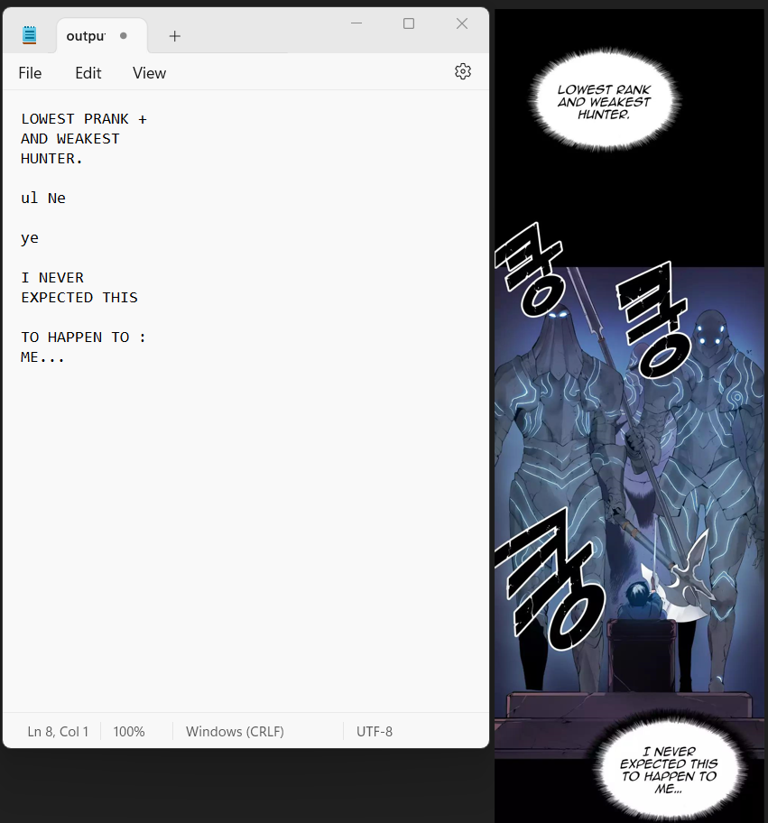

<h1 align="center">Welcome to Comic translate </h1>

## Overview
This is a Python project in which I will use OpenCV and pytesseract to process a comic image and detect text within it. In the future, I will trying to incorporate OpenAI api to translate into different language.

## Features

 - [x] Incorporate OPenCV, Pytesseract and Pillow library
 - [x] Extract the detected text into a .txt file
 - [ ] Enhanced text detection capabilities
 - [ ] Translate language wiht OpenAI api or other dependencies
 - [ ] Paste translated languaged into original image file

## Usage
1. Clone this project locally
2. Run `pip install python` in your base / command line
3. Run `pip install opencv-python` in your base / command line
4. Run `python3 -m pip install --upgrade Pillow` in your base / command line
5. For the Tesseract library, there will be more steps involved in terms of installing it.
   1. Go to https://tesseract-ocr.github.io/tessdoc/Installation.html
   2. Download the Tesseract library base on instruction on the website
   3. For window, you can download at https://github.com/UB-Mannheim/tesseract/wiki
          
   
      

## Dev Dependencies
* OpenCV
* Tesseract
* Pillow

## Author

👤 **Wayne**
* Github: [@Wayne-dot](https://github.com/Wayne-dot)
